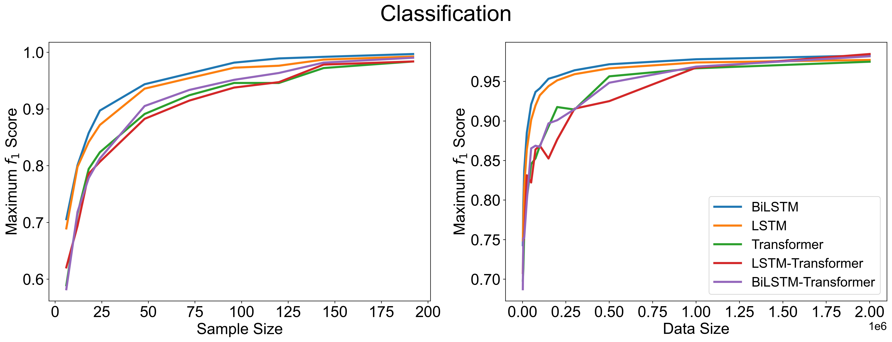
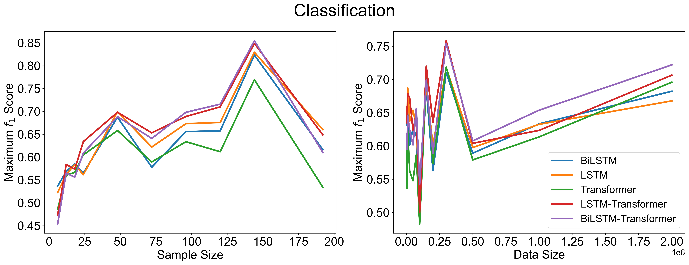

# Learn from smart electricity meter to evaluate the air conditioner’s efficiency

This is the official code repository for the paper ***Learn from smart electricity meter to evaluate the air
conditioner’s efficiency***, which is to be submitted to [Nature Sustainability](https://www.nature.com/natsustain/).

## 1. Citing this work

Please use the Bibtex below for citation of this work:

```
To Be Updated
```

## 2. Environment Setup

Experiments are conducted under Linux with Anaconda (Python 3.9) as the developing environment.

Use the following pip command to install all the required packages:

```commandline
pip install -r requirements.txt
```

## 3. Data Compilation

***Due to the privacy issues, the dataset will not be made open to public.***

However, we provide a 200
lines [sample version](https://github.com/MighTy-Weaver/SMD4RAC_Detection/blob/main/sample_data.csv) of the
full dataset to demonstrate the formation of our experimenting data, and you can check
the `preprocessing/data_compilation.py` for how our data is compiled from different categories of data.

*Remarks: Please notice that the `Location` in `sample_data.csv` are set to 0 for privacy.*

## 4. Model Training & Evaluation

All codes for Setting I are stored in `setting_1` directory, and Setting II are stored
in `setting_2` directory. Training codes and scripts are stored separately. We also provide the evaluation
codes and visualized results as shown below.


Regarding the performance of different model, we also made the following plots.

Comparison between five models in Setting I.




Comparison between five models in Setting II.




## 5. Energy Saving Result

After applying our best model on unlabelled rooms, we acquire the total electricity energy saving results by comparing
the electricity energy consumption distribution between normal RACs with poorly efficiency RACs.


## 6. Acknowledgement

This project was supported by the Undergraduate Research Opportunity Program (UROP) of The Hong Kong University of
Science and Technology (HKUST) and the Sustainable Smart Campus project of HKUST. The authors would also like to thank
the anonymous reviewers for their valuable comments and suggestions. The views and ideas expressed here belong solely to
the authors and not to the funding agencies.

## 7. Contact

If you have any question, feel free to email me at `1874240442@qq.com`. This email will be active all the time. 