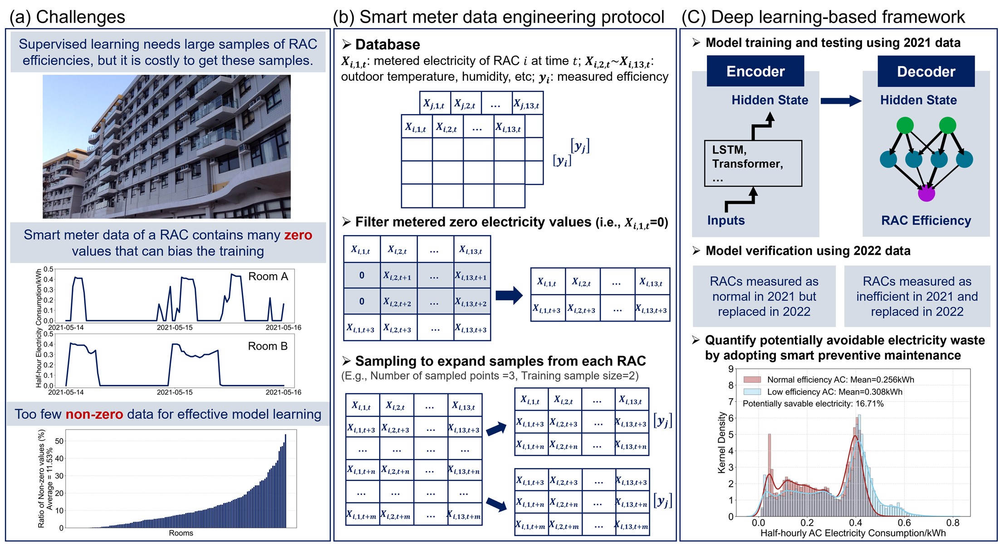

# Deep Learning Analysis of Smart Meter Data from a Small Sample of Room Air Conditioners Facilitates Routine Assessment of their Operational Efficiency

This is the official code repository for the paper
***Deep Learning Analysis of Smart Meter Data from a Small Sample of Room Air Conditioners Facilitates Routine Assessment of their Operational Efficiency***, which is under review at [Energy and AI](https://www.sciencedirect.com/journal/energy-and-ai).



## 1. Environment Setup

All experiments were conducted under Linux CentOS system with Anaconda (Python 3.9) as the developing environment.

Use the following pip command to install all the required packages:

```commandline
pip install -r requirements.txt
```

## 2. Data Compilation


***Due to the privacy issues, the dataset will not be made open to public.***

However, we provide a 200
lines [sample version](https://github.com/MighTy-Weaver/SMD4RAC_Detection/blob/main/sample_data.csv) of the
full dataset to demonstrate the formation of our experimenting data, and you can check
the `preprocessing/data_compilation.py` for how our data is compiled from different categories of data.

*Remarks: Please notice that the `Location` in `sample_data.csv` are set to 0 for privacy.*

## 3. Model Training & Evaluation

All codes for Setting I are stored in `setting_1` directory, and Setting II are stored
in `setting_2` directory. Training codes are in their respective folders, and scripts used for training are stored
in `setting_1/script` and `setting_2/script`.

We also provide the evaluation codes and visualized results as shown below.

Setting I overall performances:


Setting II overall performances:


Regarding the performance of different models, we also made the following visualization plots for comparisons.

Comparison between five models in Setting I.


Comparison between five models in Setting II.


## 4. Energy Saving Result

After applying our best model on unlabelled rooms, we acquire the total electricity energy saving results by comparing
the electricity energy consumption distribution between normal RACs with poorly efficiency RACs.
We verify our models on the data collected in 2022/2023, and the results are shown below.


## 5. Acknowledgement

This project was supported by the Undergraduate Research Opportunity Program (UROP) of The Hong Kong University of
Science and Technology (HKUST) and the Sustainable Smart Campus project of HKUST. The authors would also like to thank
the anonymous reviewers for their valuable comments and suggestions. The views and ideas expressed here belong solely to
the authors and not to the funding agencies.

## 6. Contact

If you have any question, feel free to email me at `mightyweaver829 [at] gmail.com`. This email will be active all the
time. 